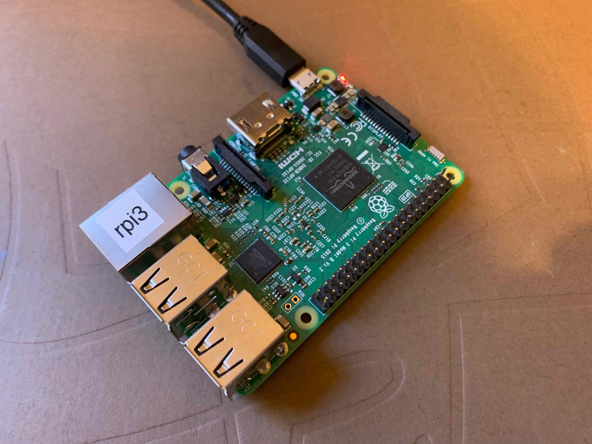
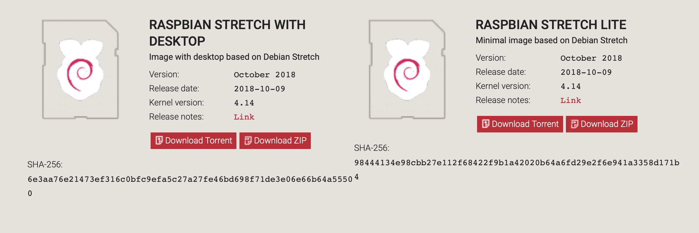
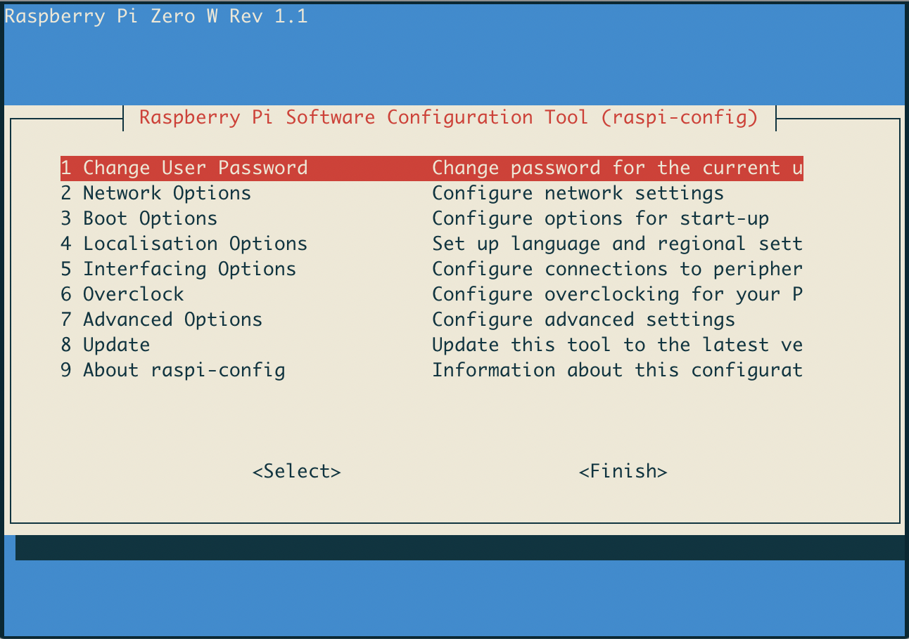

I've set up three Raspberry Pis over the last two days.
By *set up*, I mean I burned the disk image to the SD card, got the Pi connected to the network and open to SSH, installed the tools I'm going to want every time, etc.
Basically, make it just another identical worker node.
I own six Pis total (for now), so I've done this before, and I'll do it again.
In fact, two of the installs I did were on Pis I'd owned for a while; I just wanted to wipe them and start fresh.

So after the first two this weekend took me a lot longer than they should have, I realized it was about time I documented my process and made it repeatable.

<!--more-->

Most internet tutorials get you through just a few things: burning the card and connecting to wifi, maybe along with enabling SSH if you're lucky (and until this week I'd never found how to configure WiFi and SSH without direct physical access to the Pi).
If I were going to write down the setup steps anyway, I figured I might as well add them on this blog in case others find them useful.

To follow along, you'll need a Unix system and minimal experience with the command line.
I use a Mac, so the commands I use to prepare the SD card may be slightly different from those on a Linux system.
And though there are many operating systems available for the Pi, we'll be installing [Raspbian](https://www.raspbian.org), a Debian-derivative and the most common Pi OS.

Here we go.

### 0. What You Need
For the sake of anyone starting from scratch with their first Raspberry Pi, let's go over what you need.
If you already have your components, feel free to skip this bit.

When I got my first Pi, I assumed buying the board meant you had all the pieces you needed to get it running, but sadly this is not the case.
Budget an extra $20-30 on the other essentials.
1. **Board** -- The Pi itself.
Because the other components are about the same price regardless, I highly recommend you just get the newest Pi (currently [this one](https://www.amazon.com/gp/product/B07BDR5PDW/)) -- it'll be at most a 30% increase in cost for something on the order of a 4x performance gain.
2. **Micro SD Card** -- SD cards are probably best known as digital camera storage media, but this card is going to serve as the "hard drive" for your Pi.
Micro SD cards have two main attributes: size (available GB of storage) and class (roughly equivalent to speed, with higher being better and 10 being the highest).
What's important here is that everything you do -- even just using the operating system -- is going to require interacting with the SD card, so read/write speed is super important.
Even if you buy an SD card with a lot of space, if it's slow your Pi is going to be unresponsive and you'll lose your mind.
<br>
For the serious nerds, [this article](https://www.jeffgeerling.com/blog/2018/raspberry-pi-microsd-card-performance-comparison-2018) is a great test of card options.
Definitely get a Class 10 card for the speed, and check out that article if you want more specific recommendations.
As for space, it really depends on what you'll be doing with the Pi.
I like to use Pis as a sandbox environment and don't want to be limited if I ever run into something that requires a lot of space, so I always buy 32 or 64GB cards.
However, this is probably overkill; especially if you're intending to use the Pi for a very specific task, like building an alarm clock or something, you could get away with as small as 8GB.
But cards aren't that expensive, so if you want future flexibility I'd recommend 16GB at minimum and probably 32 if possible.
3. **Power** -- Annoyingly, the power cord for the Pi is about $10 -- 25% of the cost of the board.
If you expect to add to your Pi collection in the future, I recommend getting a single power supply that can handle multiple Pis, like [this one](https://www.amazon.com/gp/product/B00WI2DN4S/), currently $36.
Not only does this drop the average power supply cost per Pi to $6, it significantly reduces cable clutter.
4. **(Optional) Keyboard, Monitor/TV, HDMI cord** -- In this post I'm going to explain how to set up your Pi without these components, provided you can use your router to find your Pi's IP, but if you decide you want to have direct physical access to your device then you'll need to acquire them.
You'll only really *need* them for about 5 minutes of the process, so it's fine to temporarily commandeer a keyboard and monitor that are currently hooked up to something else.

### 1. Prepare the SD Card
In my opinion, this part seems the hardest but is usually the simplest.
Don't insert your SD card yet; we'll do that shortly.

First, download the newest image of Raspbian from [here](https://www.raspberrypi.org/downloads/raspbian/).
Currently, the download options on the page look like this:



It's up to you whether you want the desktop version or lite version; I prefer lite because I almost exclusively use my Pis via SSH (and admittedly I don't much like the Raspbian desktop anyway).
The lite version is smaller and will make the install faster, and in theory you can always install the other components of the desktop version later.
Download the zip version and unzip it, which should result in a file ending in `.img`.
This is your *disk image*, and it's what we're going to be burning to the SD card.

Okay, now the command line part.
First, a warning: we will be using commands that invoke `sudo`, meaning that you take on root privileges and can severely damage your system if you aren't careful.
Check and double-check the following commands before running them.
With that ominous introduction, open your terminal and type:
```bash
sudo diskutil list
```
You'll see several disks listed, in the form `/dev/disk1`.
Under each disk, you'll see its partitions, which each start with a number and then a colon.
Now is the time to insert your SD card.
Then run the same command again.
```bash
sudo diskutil list
```
You should see a new disk listed.
It could be `/dev/disk2` or `/dev/disk4`, etc.
**Do not use something with an `s` after the disk number, like `/dev/disk2s1`.**
This is a partition, not a disk.
Your disk should be of the form `/dev/disk<n>`.
Take note of that trailing number.
It's very important for the following steps that you use the correct one!
If you try to write to the disk of your local computer, very bad things will happen.

Now we're going to unmount the SD card.
```bash
diskutil unmountDisk /dev/disk<n>
# For example, if n=2
diskutil unmountDisk /dev/disk2
```
And we will now write our disk image to the card.
Note that in past steps we referred to the card as `/dev/disk<n>`, but here it is `/dev/rdisk<n>`.
Again, be cautious. 
```bash
sudo dd bs=1m if=<path_to_disk_image> of=/dev/rdisk<n> conv=sync
# In my case:
sudo dd bs=1m if=~/Downloads/2018-10-09-raspbian-stretch-lite.img of=/dev/rdisk2 conv=sync
```
This will take a little bit of time.
You can get updates on the progress by pressing \<ctrl\>-T.

Most tutorials have you eject the disk and stop here.
Then you need to get the Pi connected to a keyboard and monitor, log in, and set up SSH and WiFi.
But not this one!
We're going to do it all on the SD card.

The newly burned SD card should show up on your local computer at `/Volumes/boot/`.
Go there.
```bash
cd /Volumes/boot/
```
Now, to enable SSH, we can just place an empty file here.
```bash
touch ssh
```
The Pi will read this on startup and enable the sshd service.

WiFi setup is marginally trickier.
We need to create a file called `wpa_supplicant.conf` and add our network credentials to it.
In your favorite editor, create this file in the current folder and add these lines:
```text
ctrl_interface=DIR=/var/run/wpa_supplicant GROUP=netdev
network={
    ssid="YOUR_SSID"
    psk="YOUR_WIFI_PASSWORD"
    key_mgmt=WPA-PSK
}
```
Obviously replacing YOUR_SSID with the network name and YOUR_WIFI_PASSWORD with the network password.

Now cd out of the card's volume (otherwise you won't be able to eject).
```bash
cd ~
```
And eject the card, replacing \<n\> with your disk number again.
```bash
sudo diskutil eject /dev/rdisk<n>
```
Done with the SD card! 
You can physically remove it now.

### 2. Logging into the Pi
#### Getting the IP
With the card prepared, you have a few options.
You're going to need to know the Pi's IP address in order to SSH to it.
If you are familiar with your router, you can actually see all IPs on the local network via its interface; this is my preferred method.
But if you don't, you're going to need to use a keyboard, HDMI cable, and monitor the first time you boot your Pi.

Either way, insert the SD card into your Pi and plug in the device.
If you have elected the keyboard/monitor method, plug those in as well.
You'll see some blinking lights.
Wait a minute or two, which should be plenty of time for the pi to boot.

Now it's time to get the IP.
If you're doing that on your router, go right ahead and then skip to the next section.
Otherwise, log into your pi using the keyboard and monitor.
Username *pi*, password *raspberry*.
Once you're logged in, run
```bash
ifconfig | grep 192
```
You'll see a line like `inet 192.168.200.20  netmask 255.255.255.0  broadcast 192.168.200.255`.
The first IP (192.168.200.20 here) is what you want.
And now we're done with the keyboard and monitor.

#### Logging In
On your local machine, run
```bash
ssh pi@<ip>
```
where \<ip\> is the IP address we found in the last step.
If all has gone well so far, you'll be prompted for a password.
Enter our default password, *raspberry*.

Okay, you're in!
The prompt should be something like `pi@raspberrypi`.

### 3. Basic Pi Configuration
Raspbian offers a convenient configuration tool called raspi-config.
Let's start it up.
```bash
sudo raspi-config
```
If prompted for your password, enter *raspberry* again.
Your terminal will change to look something like this:



We're going to use this to configure some basic stuff.

#### Locales
First off, for some reason Raspbian seems to ship with a UK locale set by default, which you can test by typing \<shift\>+3 at some point.
It will produce the £ character instead of #.
To fix the locale, go to Localisation Options -> Change Locale.
In the list that appears, scroll down to the `EN_GB` option that is checked and use \<space\> to uncheck it.
Then scroll to the `EN_US.UTF-8 UTF-8` option and use \<space\> to check it.
Press \<enter\> to continue.

The next screen should prompt you between `C.UTF-8` and `en_US.UTF-8`.
Honestly, I'm not quite sure what the difference is, but I always choose the former and don't have issues -- so I recommend you do too.

You may be prompted to reboot at this point.
Don't do it quite yet, we have more to change.

#### Hostname
This step is optional, but I like my Pis to have unique hostnames.
In raspi-config, select Network Options -> Hostname.
If you expect to have many Pis, I strongly suggest you come up with a sensible naming scheme.
I typically use the form `rpi<major-model-no>-<number>`.
For example, if I had two Raspberry Pi 3s, I would name them `rpi3-0` and `rpi3-1`.
The particular naming scheme doesn't matter all that much, just choose something that isn't going to be really confusing later on.
Anyway, enter your chosen hostname and finish.

#### Expanding the Filesystem
Sometimes, especially if you use 64GB SD cards, the Pi won't recognize the full size of the SD card.
To make sure the filesystem is "expanded" to the whole card, go to Advanced Options -> Expand Filesystem and run it.

When all of this is complete, exit raspi-config and reboot.
```bash
sudo reboot
```

### 4. Pi Customization
#### Get vim, tmux, and git
Log back into the pi and we'll install some basic tools:
tmux, git, and vim (the full version, as opposed to the one that ships with Raspbian).
Once logged in, run the following line, enter the password (still *raspberry*) and be prepared to wait a while.
```bash
sudo apt-get update && sudo apt-get upgrade
```
This will first *update* the list of available packages based on remote servers, and then *upgrade* the ones that are present on the Pi.

Once everything is upgraded, we'll install the packages for the tools we want.
Again, this will take some time.
```bash
sudo apt-get -y install tmux && sudo apt-get -y install vim && sudo apt-get -y install git
```

#### Create a Non-pi User
In general, it's a pretty bad idea to allow SSH access to the Pi while leaving the default credentials.
It's no secret that the standard login info is pi/raspberry, and if anyone gets into your network (or you expose the Pi via port-forwarding) it's a huge security risk.
I believe the best solution is to create a new username with a different password, give that user sudo-privileges (so, like the pi user, it can perform admin tasks), and then delete the pi user entirely.

To do so (starting logged in as pi), select a username for your new user and subsitute it in the following command:
```bash
sudo adduser <new_username>
```
You'll be asked for some information about this new username.
None of it is mandatory, not even the full name.
Press enter to skip the prompts.
Once you're finished creating your user, let's add him/her to the sudo group.
```bash
sudo usermod -aG sudo <new_username>
```
With that, the new user's profile should be complete.
Log out and log back in via SSH, but this time as \<new_username\>@\<ip\> instead of pi@\<ip\>.
Time to test your new user's sudo privileges.
```bash
sudo whoami
```
As this is the first time you've invoked `sudo` as this user, you will get the customary warning (it's stolen from Spiderman, right?): "With great power comes great responsibility..."  blah blah.
Enter the password for your new user, and `whoami` should print "root".

If that worked fine, we can delete the pi user.
```bash
sudo deluser --remove-home pi
```
Now you'll always log into your Pi as this new user account.

### Bonus: Some Other Ideas
As you move into more complicated configuration, the particular steps get more involved because they depend on how your system is set up -- too involved for me to try to explain them here.
But I can recommend a few things:
- **Set up your Pi to have a static IP on the internal network.**
This will likely be an option in your router's web interface. Setting a static IP means that the IP you're using for the Pi right now won't randomly change (yeah, otherwise that happens).
- **After setting the IP, give your Pi a DNS entry.**
DNS provides hostname-IP lookup. Basically, you can give your Pi a nickname like `rpi-number-1` and use that nickname when SSHing to your Pi (instead of remembering its IP address).
It's a good idea for this "nickname" to be the same as the hostname you set on your Pi, just for consistency.
- **Create standard dotfiles and a way to install them everywhere.**
Most people have a bashrc and maybe other dotfiles that set up the shell the way they like.
It's simple to store these files in a git repo, and not so hard to write a script that updates them automatically across servers.
If you're going to be setting up many Pis, this is probably worth doing.
See [here](https://github.com/eswan18/dotfiles) for an example.
- **Use port forwarding to access your Pi from outside the local network.**
Again, this is a router-based configuration.
Port forwarding routes external connections (i.e. from the world outside your WiFi network) to specific devices on your internal network, like your Pi.
The simplest thing to do is to forward port 22 to your Pi's port 22.
Port 22 is the default port used for SSH, so this will allow you to SSH to your Pi using the IP address of your router on the internet (you can find this with a Google search for "what's my IP?" while on your WiFi network).
However, if you do this, note that you substantially increase the potential for security breaches, as anyone on the internet can try to log into your Pi.
You should disable password-based authentication (see below) if you do this.
- **Set up key-based authentication and disable password-based authentication.**
Using SSH keys, you can essentially create a unique and very secure access code to log into your Pi.
If you create such a code, store it in a secure place.
Then you can disable password-based authentication, making that key (usually very long and basically impossible to guess) the only way to get into the Pi.
This is highly recommended for devices visible outside of your local network.
