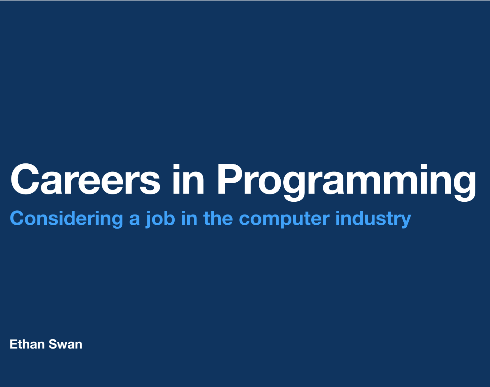

I recently visited Westville Correctional Facility, an Indiana penitentiary, to talk about jobs in the field of computing.
It was an unusual opportunity that was honestly somewhat eye-opening; never have I had so enthusiastic and engaged an audience.
I was sponsored through the Moreau College Initiative, a program in which residents of the facility are able to take full academic courses and potentially earn a bachelors degree before re-entering society.
You can read more about the program [here](https://www.hcc-nd.edu/moreau-college-initiative/), if you are so interested.

<!-- more -->

However, I imagine that an introduction to programming careers, assuming no prior knowledge whatsoever, might be useful for others.
Feel free to share the linked slides however you wish (clicking on the slide will take you to Dropbox, where you can view or download them).

