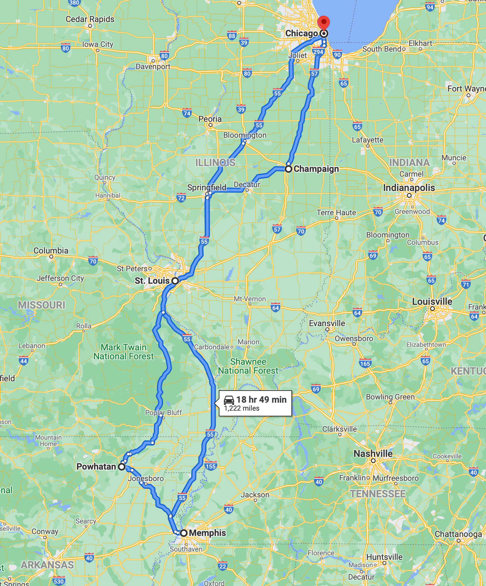

I recently returned from a 10-day road trip. Nowhere too exciting, just through the middle of the continental US: St. Louis, Memphis, northeast Arkansas, and Champaign (home of the University of Illinois Urbana-Champaign).

People who know me probably wouldn't describe me as the road trip type. But I had a few weeks off before I started a new job and the opportunity to travel without any commitments (or a finite amount of PTO) doesn't present itself often; I figured that there would never be a better time to travel somewhat spontaneously. And spontaneous it was, as for several of my stops, I booked my Airbnb the same day I arrived in the city.

<!-- more -->

Parts were fun, and other parts were a bit of a drag. More importantly though, it was a great experience. I finished it with the sense that I would enjoy similar trips much more in the future, having acquired some understanding of how to execute them well.

## Plan Around Laundry

Having enough weather-appropriate clothes available proved to be a significant obstacle in my adventure. If you're traveling beyond a few days, particularly in the cold months, variation in the weather necessitates bringing a substantial amount of clothing. This problem is exacerbated if you plan to exercise on the trip, since you'll only get one wear out of those clothes. You're sure to run out of useful apparel very quickly, and that means one thing: doing lots of laundry.

I couldn't see any way around doing laundry every couple of days. I only had two sweatshirts, one pair of sweatpants, one thermal layer, a few pairs of athletic socks -- and I brought a lot of clothes! Foolishly, at most stops I failed to prioritize a washer/dryer in my search for Airbnbs. That's a mistake I won't make in the future.

I suspect this could be less of an issue in the summer months, since clothes for that season are smaller and you can bring more in the same amount of space. But even so, my experience has been that I always run out of *something* after four days, no matter how well I think I've packed. On a real road trip, it seems worth finding a way to get laundry done, at least at every other stop.

## Getting Exercise in the Middle of Nowhere is Hard

I had this idea that if I stayed somewhere remote enough, I could just walk out my door and go for a run through ... I don't know, fields? mountains? Turns out that is not correct, as I learned when I stayed at a lakeside cabin outside a town of population 104 in rural Arkansas.

Instead of being more walking-oriented, I found I couldn't go *anywhere* except my yard without driving. In terms of walkability, it was worse than the deep suburbs where I grew up, because when you're that remote you can't even walk on the roads as you might in a suburban neighborhood. My "driveway" was more than half a mile of gravel connecting about 10 houses along the way. It somehow felt like almost an invasion of privacy to pass by these houses on foot, but even if I did decide to, that "road" led to a de facto rural highway with no sidewalks or berm; walking there would not have ended well.

So basically, I could either drive to a state park -- there was nowhere else nearby with trails, just farms -- or exercise in my little cabin. The latter meant never leaving the house all day, so I made the commute. Of course, state parks aren't all that numerous, so after I thorougly explored the nearest one the first day, my next-closest option was 50 minutes away.

All that's to say: while the dream of running the countryside sounds great, unless you make a special effort to stay somewhere adjacent to a large park or trail system, you're going to have substantially worse running and walking options than you would in a suburban area.

## Staying Multiple Nights

Simply from a cost perspective, staying multiple nights makes sense. Unlike hotels, Airbnbs typically charge a flat, one-time "cleaning fee". It's not always significant, but it usually is. That makes single-night stays much more expensive per night than longer visits, since you pay that fee for every new place. Over the course of a long trip, paying that fee more than you need to can add up.

But even if you can avoid (or stomach) the fees, single night stays have another substantial downside: you don't have a home base for 4 hours or so during the middle of the day. That means that if you want to exercise, you need to either do that pretty early – so you have time to shower, pack up, and check out after – or in the evening. And that constraint ripples into your ability to do other things at specific times during the day.

Additionally, not having anywhere to go for those hours means you can either spend the time in coffee shops and restaurants, or in your car. If you have a long drive ahead of you that day, that works fine, but on days with shorter drives I found myself just filling time.

While both those issues are manageable, I'll plan for fewer, longer stays in the future.

## It's Not a Bad Life

I didn't expect to like traveling as much as I did, especially the spontaneous part. But it was really nice to be in places that I could feel like I was "exploring", in contrast to a neighborhood where I've lived for 18 months. Working out and eating well proved to be the biggest challenges, but they felt far from insurmountable. If I have the chance to do more road trips, I'd like to think they'll only be better.
