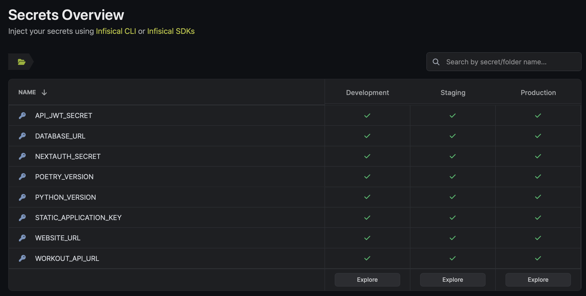

For the last year or so, I've been chipping away at a side project: a weightlifting-tracking app.
The ostensible purpose is to store the metrics I want and make data entry as convenient as possible, but in practice it's mainly a way for me to become more familiar with the development of a "large" web application and the challenges that come with it.

A challenge I wasn't excited for was finding a way to host everything for free or nearly free; I have no expectation of having any users beyond myself, let alone commercializing, so paying significant infrastructure fees was off the table.
This was made more difficult by my architectural requirements (and tendency toward overengineering):
1. Separate hosting of different services, with each being able to be deployed independently. Those services:
    - A persistent database
    - A back end API that manages access to that database
    - A responsive front end that interacts only with the API
2. Connections between environments controlled via centrally-managed secrets or some other kind of environment variable management
3. A staging environment for both the front end and back end services, along with completely separate staging data
4. Deployment that can be automated via a hook, a GitHub Actions workflow, or even just a shell script run locally
5. Reachable from the public internet

Incredibly, I found a way to check all those boxes, with just one significant sacrifice along the way.

## Overview

- **Front end** – A Next.js app hosted in [Vercel](https://vercel.com). A great platform with no real issues except some tricky UI.
- **Back end** – A FastAPI app hosted in [Render](https://render.com). Render has some downsides, the most significant of which is that idle apps spin down and take a long time to restart.
- **Database** - Serverless Postgres offered by [Neon](https://neon.tech). Free database hosting was extremely difficult to find and I only heard about Neon recently, but it's been solid.
- **DevOps** – For deployment, Vercel and Render handle that automatically. I deploy database changes manually with scripts. For secrets management, I'm using [Infisical](https://infisical.com). It offers integrations with lots of services and has a very clear development/staging/production setup, but is also a little bit unpolished.

Four platforms, all on the free tier, and the only real issue in this stack is the cold start time of the back end.

## Front End ([code](https://github.com/eswan18/workout-fe))

The front end is a Next.js app, and that made Vercel a natural first place to look for hosting.
Next.js is a framework for building React apps, providing a lot of structure and some additional magic around things like routing.
Vercel is the company that maintains it.

Hosting on Vercel's platform was a breeze except for some occasionally confusing UI.
It offers direct GitHub integration so that it can redeploy your app on every push.

You can specify a "production" branch, and (it seems like) only commits on that branch will ever make it to the production environment of your Vercel workspace.
But additionally it will deploy "preview builds" of the other branches and alert you if they fail.
I was able to set this up so that only the staging branch was deployed in preview, just to avoid the noise of all my random feature branches being auto-deployed.

Vercel also offers the ability to set environment variables for your app and to scope them across all environments or just the production build, or the preview build, or the preview build on a particular branch.
This made it possible to connect the production app to the production API back end, but the *staging* preview to the *staging* back end.
Better still, all these environment variables can be configured from a CLI.

Last, the app responds very quickly even when it hasn't been requested for hours.
It doesn't seem like Vercel is spinning it down when idle.

Overall, using Vercel is a decision I haven't second guessed.

## Back End ([code](https://github.com/eswan18/workout-api))

I used Python and FastAPI for the back end, and hosted it with a service I heard about via Reddit: Render.

Render doesn't seem to be affiliated with any particular language or framework -- unlike Vercel, which is clearly dedicated mainly to Next.js.
It will build and deploy your app for free, as long as you don't exceed certain limitations on build minutes and uptime minutes.
I was initially sold on Render because it was one of the only platforms supporting Python 3.11.

However, Render is clearly my least favorite part of this tech stack.
It doesn't offer anything like a staging or preview environment, so I had to set up two separate projects and just configure the default GitHub branch differently (one uses `main` and the other `staging`).

More importantly, it spins down your app after a few minutes of inactivity and then has to cold start on the next request, which takes eons.
I'm actually a bit confused about why app restarts take so long -- always at least a few minutes.
The underlying image is definitely already built, and starting the app on my local machine takes under three seconds.

In any case, this is pretty frustrating.
When you visit the front end, a request will be sent to the back end but it will time out while the API starts up, so users get an error and have no recourse but to wait a few minutes.

I'm on the lookout for a better alternative to Render but haven't found anything yet. RIP Heroku.

## Database

I manage the database with [alembic migrations](https://github.com/eswan18/workout-api/tree/main/alembic) and a few other [sql and bash scripts](https://github.com/eswan18/workout-api/tree/main/db).
From the beginning, I'd chosen Postgres as my database in local development, and after writing triggers and relying on Postgres-specific types, I was reluctant to migrate.

That narrowed my options for a cloud solution, as I needed something fully Postgres compatible.
I briefly considered Amazon's RDS, but getting into AWS for a single service seemed more trouble than it was worth.
Then very recently I heard about Neon, a "serverless" Postgres solution.

I set up different databases[^pg-database] and users for staging and prod, then ran all my migrations and added my views.
This process was pretty manual, with me creating the databases, adding the users, configuring each user to have access to its own database (prod user can see only prod, staging only staging), and initiating migrations for each database.

I haven't explored Neon too deeply but my experience with other hosted databases is that the hosting service won't handle things like your migrations for you, probably because those are often quite bespoke and customized to an application.
Fortunately, it's easy to write scripts to manage this sort of thing since you can just pipe sql code into the `psql $DATABASE_URL` command.
Managing the database hasn't proven too onerous.

Despite being "serverless", Neon doesn't seem to have any meaningful cold start delay.
All in all, I've been very happy with it so far.

## DevOps

### CI/CD

I touched on this in previous sections, but Vercel and Render offer easy integration with a GitHub repo and even control over deploying specific branches.

I still have GitHub Actions running on the back end repo to handle linting, type checking, and testing.
Ideally I'll build out those things in the front end as well but, being much less familiar with the Javascript ecosystem, I haven't gotten to that.

On the other hand, deploying updates to the database is extremely manual and I'd like to find (or build) some better workflow.
I create migrations in the back end repo but have to run them against the staging and prod databases every time.
Similarly, I have views defined in that repo and have to drop and recreate them manually on each change.
It seems possible to automate both of those things, although by keeping my views separate from migrations, they'd probably have to be rerun on every deploy (there's no  neat way to detect new changes, analogous to the way migrations are stored in a table)

A problem for another day, as right now I don't change the database often enough for the deployment flow to bother me.

### Environment Secrets

I settled on Infisical for my secrets management only after trying out Hashicorp Vault Secrets and finding it overcomplicated.
It didn't seem well suited to my use case, providing many features I didn't need but also no simple way to keep a set of variables but assign different values in development/staging/production for each.

Infisical is free if you can limit yourself to three environments (again, I just have development, staging, and prod) and makes this very simple: from the get-go, your environment variables are shown in a grid that emphasizes how the same variable has different values in each environment:

The platform offers integrations to many other services, including both Vercel and Render.
It also has a CLI tool for viewing and modifying secrets.
So far, great service.

The main trouble with Infisical is that right now there isn't a good way to designate different secrets as applicable to different apps -- a useful feature from a security perspective, so that each app has access only to the secrets it needs.
You can store your secrets in folders and only pull the contents of one folder to an app, but that won't work for secrets needed by more than one app.
You can "tag" your individual secrets with one or more strings, and initially this seemed like a good solution.
But with integrations, all your secrets get pulled regardless of tag.
Arguably worse, the CLI lets you specify a tag but completely ignores your input and returns all secrets anyway.

These issues are surely on the roadmap for the platform, and I can live with the marginal security sacrifice for my toy app.
Infisical has been a good tool in most ways.

[^pg-database]: To be clear, "database" in this sense is a self-contained workspace within the application that can hold various tables, views, functions, schemas, etc. This terminology is wildly confusing since you might call the whole Postgres installation a database. However, an instance of Postgres can itself contain many separate databases, and in this situation I created one database for staging and one for production, both in the same instance.