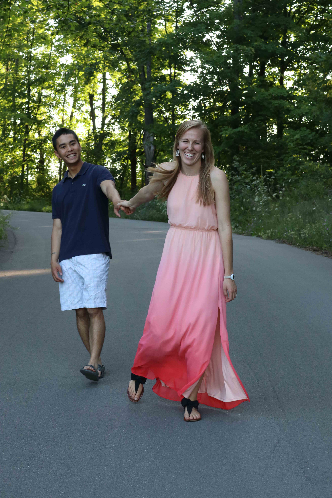

# Places to Stay and Eat in the Area

## Hotel Blocks
- **Drury Inn & Suites Grand Rapids**
    - *8 minutes from Gerald R. Ford International Airport and 5 minutes from the reception*
    - **Address**: 5175 28th Street SE Grand Rapids, MI 49512
    - **Phone**: (616) 942-8511
    - Call in and book for "Schichtel/Garcia wedding", use the group number 2347947, or follow [this link](https://www.druryhotels.com/bookandstay/newreservation/?groupno=2347947).
- **DoubleTree by Hilton Grand Rapids Airport**
    - *7 minutes from Gerald R. Ford International Airport and 7 minutes from the reception*
    - **Address**: 4747 28th St. SE Grand Rapids, MI 49512
    - **Phone**: (616) 957-9072
    - Call in and book for “Schichtel/Garcia wedding” or follow [this link](https://secure3.hilton.com/en_US/dt/reservation/book.htm?inputModule=HOTEL&ctyhocn=GRRAIDT&spec_plan=CDTSGW&arrival=20190503&departure=20190505&cid=OM,WW,HILTONLINK,EN,DirectLink&fromId=HILTONLINKDIRECT).
- **Amway Grand Plaza Hotel** (Downtown)
    - *19 minutes from Gerald R. Ford International Airport and 16 minutes from the reception*
    - **Address**:187 Monroe Ave NW, Grand Rapids, MI 49503
    - **Phone**: (800) 253-3590
    - Call in and book for “Schichtel/Garcia wedding” or follow [this link](https://book.passkey.com/e/49745695).

## Food Options
### <u>Near the Ceremony</u>

- **Herman's Boy** (Bagels and Coffee)
    - *2 min from the ceremony* - 220 Northland Dr NE, Rockford MI 49341
    - Bagels, coffee, other delicious things. Libby recommends an Eggel on ultimate bagel with cheddar cheese and a bacon or a pecan roll.
- **Corner Bar**
    - *3 min from the cermony* - 31 N Main St, Rockford, MI 49341
    - Renowned hot dog establishment in downtown Rockford.
- **Rocky's**
    - *3 min from the ceremony* - 110 N Main St, Rockford, MI 49341
    - Ice cream!!

### <u>Downtown</u>

#### *Ice Cream*
- **Furniture City Creamery**
    - *6 min drive from Amway Grand Plaza* - 958 Cherry St SE, Grand Rapids MI 49506
- **Jersey Junction**
    - *12 min drive from Amway Grand Plaza* - 652 Croswell Ave SE, East Grand Rapids MI 49506
- **Spoonlickers** (Frozen Yogurt)
    - *4 min drive from Amway Grand Plaza* - 616 Fulton W, Grand Rapids, MI 49504
- **Pinkie's Ice Cream and Desserts**
    - *15 min drive from Drury Inn* - 1127 Wealthy St. SE, Grand Rapids, MI 49506

#### *Not Ice Cream*
- **Ferris Coffee**
    - *194 feet from Amway Grand Plaza* - 40 Pearl Ave NW, Grand Rapids MI 49503
- **Yesterdog** (Hot Dogs served until 2:30 AM!)
    - *10 min from Amway Grand Plaza* - 1505 Wealthy St SE, Grand Rapids MI 49506
- **Donkey Taqueria** (Google Maps calls it a "happening Mexican joint... features an extensive tequila menu")
    - *8 min from Amway Grand Plaza* - 665 Wealthy St, Grand Rapids MI 49503
- **Founder's Brewing Co.**
    - *4 min Uber/14 min walk from Amway Grand Plaza* - 235 Grandville Ave SW, Grand Rapids MI 46503

[Back to wedding home page](/tosstherice)
